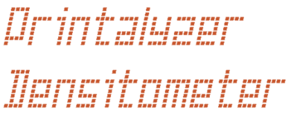
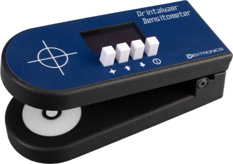

# Printalyzer Densitometer

## Introduction

The Printalyzer Densitometer is a project whose goal is the creation of an
affordable reflection and transmission densitometer for photographic darkroom
use.

It was initially conceived as an accessory to complement the
[Printalyzer Enlarging Timer & Exposure Meter](https://github.com/dektronics/printalyzer-timer)
to ease the process of creating paper profiles. However, given the general
utility of such a device, it has been spun off as a separate project in its
own right.

A good overview of the project can be found in these blog posts:
* [The Printalyzer Densitometer Project](https://hecgeek.blogspot.com/2021/07/the-printalyzer-densitometer-project.html)

This project, using hardware tagged as "Revision C" and labeled as DPD-100, is currently shipping as an official Dektronics [product](https://www.dektronics.com/printalyzer-densitometer). Links to the user manual and regulatory compliance documents can be found on the product website.

## Project Layout

### Hardware
The "hardware" directory contains [KiCad](https://www.kicad.org/) projects
with the complete circuit schematics, bill-of-materials, and
PCB layouts.

### Software
The "software" directory contains all the source code for the firmware
that runs on the hardware.

### Enclosure
The "enclosure" directory contains any CAD models and related resources
necessary to physically assemble the device.

## License
Individual directories will contain LICENSE files as needed, with relevant
details. Generally, the hardware will be CC BY-SA and the software will be
BSD 3-Clause. However, external resources may have their own individual license terms.
